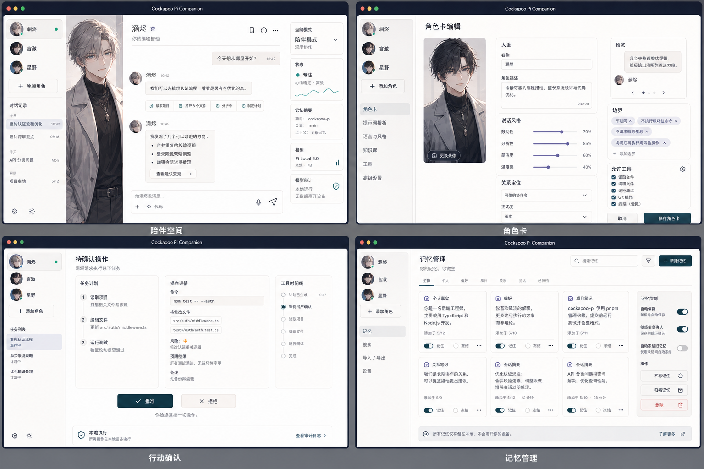

# Cockapoo Pi Companion

> 中文简介：本地优先的 AI 伴侣桌面客户端，基于 Pi coding-agent SDK 构建。（中文文档待补充）

Cockapoo Pi Companion is a local-first AI companion and coding-agent desktop client built on the [Pi coding-agent SDK](https://www.npmjs.com/package/@earendil-works/pi-coding-agent). Pi owns the embedded agent runtime; Cockapoo owns the product layer: character cards, local memory, a fail-closed safety confirmation gate, character skills, scheduled tasks, and subagents.



## Workspace

```text
apps/
  desktop/          Tauri + React desktop shell
    src/            React frontend (chat, character surfaces, settings)
    src-tauri/      Rust backend; spawns the sidecar and brokers stdio
    sidecar/        Node sidecar embedding the Pi SDK (sessions, memory
                    bridge, tool-policy gate, subagents, web access)
characters/         Bundled character card packages (.card) and manifest
packages/
  character-card/   Character schema and deterministic prompt composition
  pi-runtime/       Adapter layer for Pi SDK sessions and events
  memory/           Local-first memory contracts and backends
  safety/           Tool modes, confirmation policy, protected paths
  companion-core/   Shared domain types for companion sessions
  ui/               Shared UI surfaces for the desktop companion
docs/               Implementation notes (e.g. character card authoring)
```

## Getting Started

Prerequisites:

- Node.js 22+
- [pnpm](https://pnpm.io/)
- [Rust toolchain](https://rustup.rs/) (required by Tauri)

```bash
pnpm install

# Start the Tauri desktop app in dev mode
pnpm dev
```

Other useful scripts:

```bash
pnpm desktop:vite   # frontend only, Vite dev server on 127.0.0.1:1420
pnpm desktop:build  # production desktop build (tauri build)
```

## Testing

There are three test entry points, all on the Node built-in test runner:

```bash
# Character-card package (schema + prompt composition)
node --test packages/character-card/test/*.test.mjs

# Sidecar (session adapter, memory bridge, tool gate, subagents, ...)
cd apps/desktop/sidecar && node --test test/*.mjs

# Desktop frontend models (type-stripped TS tests)
cd apps/desktop && node --experimental-strip-types --test "src/components/*.test.ts"
```

## Architecture

- **Desktop shell.** The Tauri Rust backend (`apps/desktop/src-tauri`) hosts the React frontend and spawns the Node sidecar on demand, communicating with it over stdio.
- **Sidecar.** The sidecar (`apps/desktop/sidecar`) embeds the Pi coding-agent SDK and runs the actual agent sessions. It wires in the memory bridge, model/provider resolution, web access, and subagent spawning.
- **Safety layer.** Tool calls pass through a fail-closed tool gate: unknown or disallowed tools are blocked by default, a confirmation policy escalates risky operations to the user for explicit approval, and protected paths guard sensitive locations on disk.
- **Product layer.** Character cards (`characters/`, `packages/character-card`) compose deterministic system prompts; local-first memory, character skills, scheduled tasks, and subagents sit on top of the Pi runtime.

## License

Licensed under the [Apache License, Version 2.0](LICENSE).
